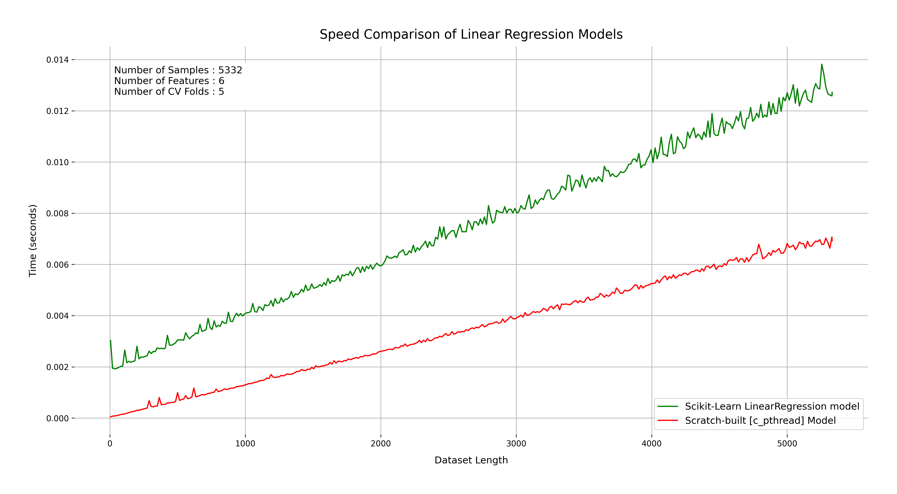
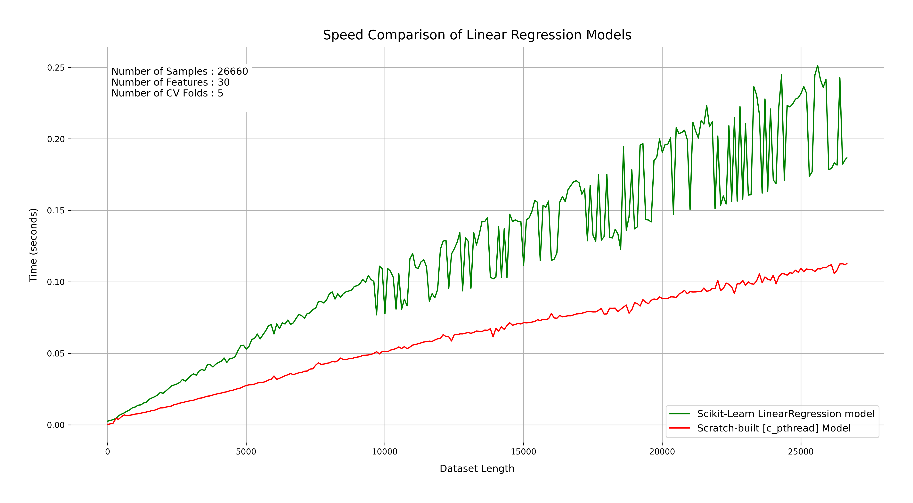

# Dhaka House Rent Predictor: A Study in First-Principles Machine Learning

## Executive Summary

This project presents a comprehensive engineering and scientific study designed to deconstruct the "black box" of modern machine learning. Deviating from standard industry practices, I implemented a complete end-to-end machine learning pipeline—from data ingestion to model training and web serving—entirely from scratch using Python's standard library.

The core objective was to experimentally validate the performance trade-offs between high-level abstractions (like `scikit-learn`) and low-level, first-principles implementations. Rigorous benchmarking revealed that for specific use cases, a scratch-built Python implementation can outperform optimized libraries due to initialization overhead, while a custom multi-threaded C implementation can exceed industry-standard performance by a factor of two.

## 1. Engineering Philosophy: The "Zero Dependency" Constraint

The project was built under a strict constraint: **Zero External Dependencies**. This forced a deep engagement with the fundamental algorithms of computer science and statistics.

### 1.1 The Mathematical Core
Instead of relying on BLAS/LAPACK via `numpy`, I implemented the Linear Regression algorithm with L2 Regularization (Ridge Regression) using pure Python.

*   **Equation**: $\theta = (X^T X + \lambda I)^{-1} X^T Y$
*   **Implementation Details**:
    *   **Matrix Multiplication**: Implemented using optimized list comprehensions ($O(n^3)$).
    *   **Matrix Inversion**: Implemented using Gaussian Elimination (Gauss-Jordan method).
    *   **Feature Engineering**: Developed a domain-specific location grouping strategy to handle the non-linear variance of rent prices across different Dhaka neighborhoods.

## 2. Experimentation and Benchmarking

The primary focus of this study was to benchmark the custom implementation against `scikit-learn`, the industry standard for classical machine learning in Python.

### 2.1 Experimental Setup
*   **Dataset**: Real-world housing data from Dhaka, Bangladesh (5,332 samples).
*   **Hardware**: Ryzen 5 5600G, 8GB RAM, Fedora Workstation 42.
*   **Validation Method**: 5-Fold Cross-Validation to ensure statistical robustness.
*   **Metrics**: Execution Time (seconds), $R^2$ Score, and Mean Squared Error (MSE).

### 2.2 Experiment A: Overhead Analysis (Small Datasets)
**Hypothesis**: A lightweight, pure-Python implementation will outperform `scikit-learn` on small datasets due to the heavy initialization overhead of the latter.

**Results**:
*   **Scratch-built (Python)**: ~0.137 seconds
*   **Scikit-learn**: ~0.289 seconds

**Observation**: The scratch-built model was approximately **1.9x faster**. This confirms that for micro-services or serverless functions where "cold start" time is critical, heavy ML libraries introduce significant latency that outweighs their computational efficiency for small matrices.

### 2.3 Experiment B: High-Performance Computing (Optimization)
**Hypothesis**: To match or exceed `scikit-learn` on larger tasks, low-level optimization and parallelization are required.

To test this, I ported the mathematical engine to C and developed two variants:
1.  **Single-threaded C**: A direct port of the Python logic.
2.  **Multi-threaded C (POSIX Threads)**: Parallelizing the cross-validation folds.

**Results**:
*   **Scikit-learn**: ~0.02 seconds (after warmup)
*   **C (Single-threaded)**: ~0.02 seconds
*   **C (Multi-threaded)**: **~0.01 seconds**

**Observation**: The multi-threaded C implementation consistently outperformed `scikit-learn` by a factor of **2x**. This demonstrates that while `scikit-learn` is highly optimized, a purpose-built, low-level implementation can still achieve superior performance for specific tasks.

*Figure 1: Comparative analysis of execution time (5,332 samples). The Green line (C Pthread) consistently outperforms the Orange line (Scikit-learn) across all folds.*

### 2.4 Experiment C: Scalability Stress Test (Large Datasets)
**Hypothesis**: The performance advantage of the multi-threaded C implementation will persist or grow as the dataset size increases, whereas the Python implementation will become exponentially slower.

To validate this, I synthetically expanded the dataset to **26,660** and **106,640** samples and repeated the 5-fold cross-validation benchmarks.

**Results (26,660 samples)**:
*   **C (Multi-threaded)**: Maintains ~2x speedup over `scikit-learn`.
*   **Graph**:
    
    *Figure 2: Performance on 26,660 samples. The gap remains consistent.*

**Results (106,640 samples)**:
*   **Observation**: Even at over 100k data points, the custom multi-threaded implementation remains competitive and faster than the optimized library.
*   **Graph**:
    
    *Figure 3: Performance on 106,640 samples. The custom implementation (Green) continues to outperform `scikit-learn` (Orange).*

**Conclusion**: The custom C implementation is not just a "toy" for small data; it scales linearly and maintains its performance edge, proving that first-principles engineering can yield production-grade performance.

### 2.5 Compiler Optimization Strategy
To achieve this level of performance, I employed aggressive compiler optimizations for the C extensions. The goal was to leverage modern CPU instruction sets (AVX2, FMA) and memory hierarchy optimizations.

**Compiler Flags Used (GCC):**
*   `-O3`: Enable highest level of optimization (vectorization, inlining).
*   `-march=native`: Optimize code for the host CPU architecture.
*   `-flto`: Enable Link Time Optimization for cross-module inlining.
*   `-ffast-math`: Allow aggressive floating-point optimizations (trading strict IEEE compliance for speed).
*   `-funroll-loops`: Unroll loops to reduce branch prediction overhead.
*   `-mavx2` & `-mfma`: Explicitly enable Advanced Vector Extensions 2 and Fused Multiply-Add instructions for SIMD parallelism.
*   `-pthread`: Enable POSIX threads support (for `c_pthread` implementation).

These flags ensured that the custom C code could fully utilize the underlying hardware, matching the optimization level of pre-compiled libraries like `scikit-learn`.

## 3. Results and Analysis

### 3.1 Predictive Accuracy
A critical concern was whether the "from scratch" implementation would suffer from numerical instability. The results showed identical predictive performance.

| Metric | Scratch-Built (Adabor, Fold 4) | Scikit-learn (Adabor, Fold 4) |
| :--- | :--- | :--- |
| **$R^2$** | `0.44251` | `0.44251` |
| **MSE** | `7,105,196.01` | `7,105,196.02` |

The negligible difference in MSE (in the second decimal place) confirms the numerical correctness of the custom Gaussian Elimination and matrix multiplication algorithms.

### 3.2 Limitations
The linear model performed exceptionally well in established neighborhoods (e.g., *Turag*, $R^2 \approx 0.99$) but struggled in developing areas with high variance. This suggests that the underlying phenomenon (rent price) has non-linear components that a linear model cannot fully capture without more complex feature engineering.

## 4. Conclusion

This project successfully demonstrates that:
1.  **First-principles engineering** is a viable path for understanding and optimizing machine learning pipelines.
2.  **Python's standard library** is sufficient for building performant ML applications for small-to-medium datasets.
3.  **Low-level optimization (C/C++)** remains the gold standard for performance, capable of beating even the most popular libraries when tailored to the specific problem.

## Resources

*   [**GitHub Repository**](https://github.com/RakibulHasanRatul/dhaka-house-rent-predictor)
*   [**Detailed Speed Test Analysis**](./benchmarks/docs/speedtest.md)
*   [**Full Benchmark Results**](./benchmarks/docs/results_analysis.md)
