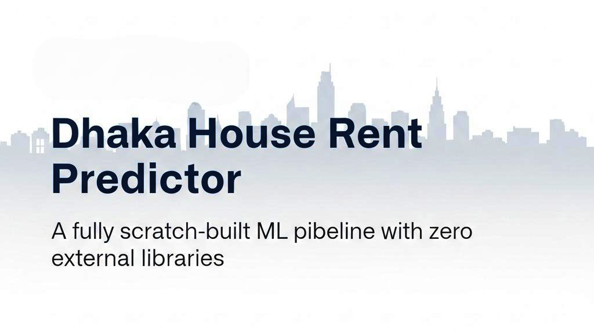
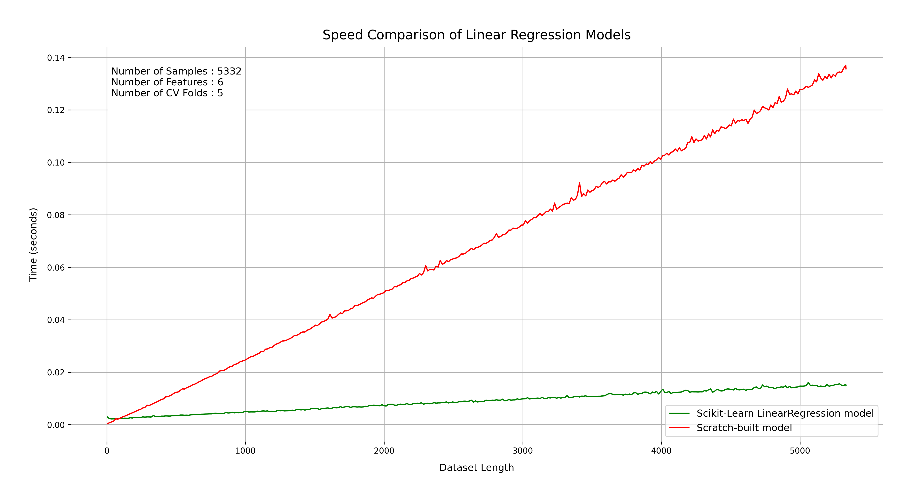
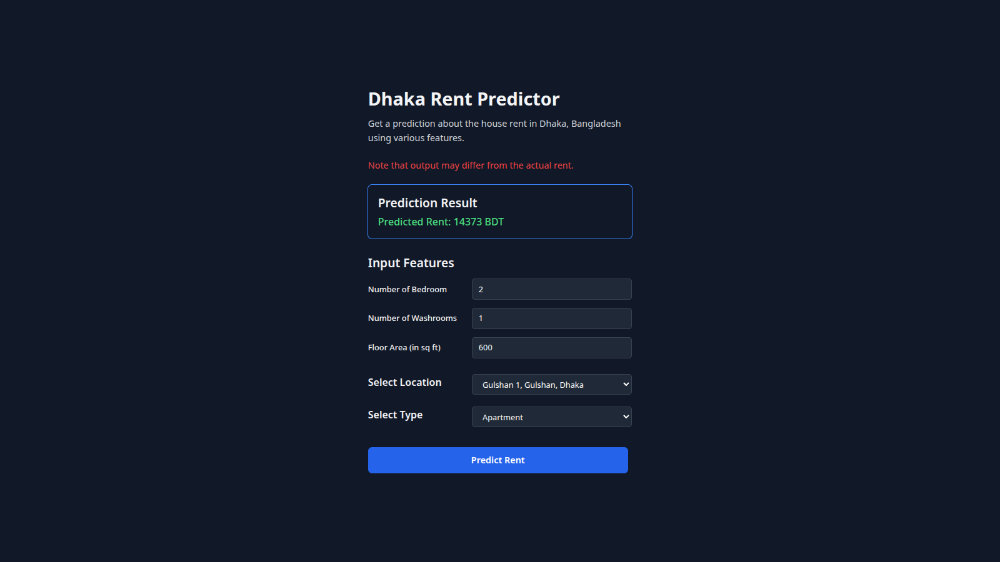
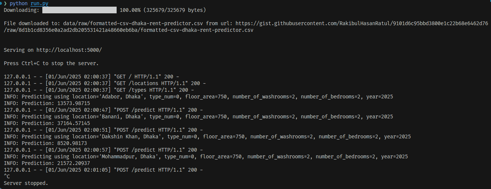
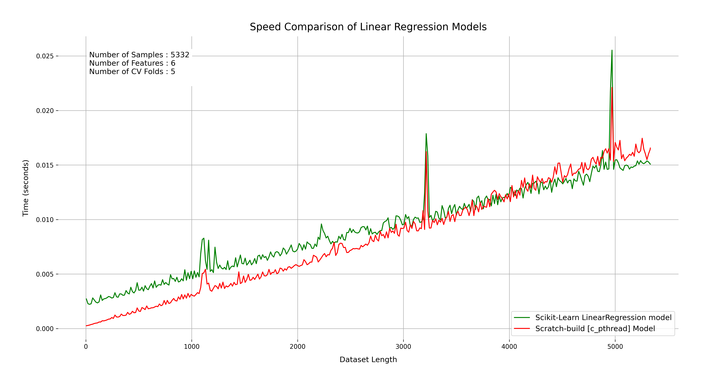

# Dhaka House Rent Predictor: A Machine Learning Model Built from Scratch

A machine learning program to predict house rent in different locations in **Dhaka, Bangladesh**.

<p align="center">
  
</p>

## Overview

This project is a simple Python program that predicts house rent at various locations in Dhaka, Bangladesh, using a linear regression model with L2 Regularization built completely from scratch. From data ingestion to rent prediction, this project covers **all aspects of the machine learning** pipeline, including data preprocessing, feature engineering, model training, and evaluation **without reliance on any external libraries**. The project also **includes a web interface** for user interaction, allowing users to input their own data and receive rent predictions in real-time.

What's truly surprising is that this scratch-built model performs almost identically to highly optimized Scikit-learn's `LinearRegression` in terms of performance metrics like R-squared ($R^2$), Mean Squared Error (MSE), and Mean Absolute Error (MAE). Check out the detailed analysis in the [Performance Analysis](#performance-analysis-against-scikit-learn) section.

The model also offers surprisingly fast performance, able to be trained for delivering predictions in **under 0.2 seconds for 5332 datasets** using pure Python. In fact, it’s been benchmarked (for training and delivering prediction) to run **up to 1.9× faster** than Scikit-learn’s implementation on **smaller datasets** just because of _numpy warmup time_, as shown in the [speedtest.md](./speedtest.md) file. **_However, performance significantly drops on larger datasets, where Scikit-learn's optimized implementation clearly outperforms the scratch-built model._**

> One line summary: Predicts house rent in Dhaka using a fully scratch-built ML pipeline with zero external libraries.

## Table of Contents

- [Engineering Against The Odds](#engineering-against-the-odds)
- [What Makes It Stand Out](#what-makes-it-stand-out)
- [Performance Analysis Against Scikit-learn](#performance-analysis-against-scikit-learn)
- [Location-wise Performance](#location-wise-performance)
- [How Does It Work](#how-does-it-work)
- [Why I Built Everything from Scratch](#why-i-built-everything-from-scratch)
- [How to Run](#how-to-run)
- [Usage Example](#usage-example)
- [Further Tweaks](#further-tweaks)
- [Future Plans](#future-plans)
- [Author](#author)
- [License](#license)

## Engineering Against The Odds

This project embraces several unconventional engineering choices — deliberately avoiding external libraries and modern frameworks — to showcase the true power of raw Python and algorithmic fundamentals.

- **Using ZERO external dependencies**

  Despite the common reliance on libraries like `Numpy`, `Pandas`, `Scikit-learn`, etc., this project builds everything from the ground up. That includes loading data from CSV files, displaying a download progress bar, training the model, preprocessing data, feature engineering, and even serving the web interface — **all using only Python's standard libraries**. This truly demonstrates a strong grasp of core programming concepts.

- **Unpredictability of house rents in Dhaka**

  House rental prices in Dhaka, Bangladesh, often don't follow straightforward mathematical patterns. Instead, they're heavily influenced by the **socio-economic conditions of a specific location**. For example, houses with **identical specifications** can command **2 to 3 times higher rents in affluent areas like Gulshan** compared to Dakshinkhan. This project uses **clever, domain-specific feature engineering** to capture these unique, location-based patterns.

- **Server backend using _http.server_**

  While most web applications leverage robust frameworks like `Flask` or `Django`, this project showcases Python's built-in `http.server` module to create a simple, lightweight, and self-contained web server. This keeps the entire stack incredibly lean.

- **Implementation of fundamental matrix calculations**

  Instead of relying on highly optimized external libraries for matrix operations, this project implements core matrix calculation logic for linear regression algorithm from scratch. This includes **Gaussian Elimination** (or Gauss-Jordan Elimination) for matrix inversion, and standard textbook methods for multiplication and transpose. This provides complete control over the mathematical heart of the model, proving its feasibility while still maintaining suitable performance for the dataset size.

## What Makes It Stand Out

- **Zero External Dependencies**

  From model training to the web interface and its backend — **everything is built using Python’s standard library only**!

  ⛌ No `Numpy`, `Pandas`, or **similar data manipulation libraries.**
  ⛌ No `Flask`, `Django`, `FastAPI`, **or other web frameworks.**
  ✓ Exclusively uses built-in Python libraries (e.g., `csv`, `json`, `http.server`).
  ⛌ No `Scikit-learn`, `TensorFlow`, or **other machine learning libraries** at all.

  A minimalist [`pyproject.toml`](./pyproject.toml) confirms zero external runtime dependencies.

- **Domain-Specific Feature Engineering**

  The project incorporates a **feature engineering** step that groups data based on location. This is absolutely crucial for capturing the unique characteristics of each area, which significantly drive rent prices in Dhaka.

  [[Code: `app/handler/data/preprocess.py`](./app/handler/data/preprocess.py)]

- **Linear Regression from Scratch**

  The model uses a vector algebra–based linear regression approach for rent prediction. The formula used to determine the weight vector ($\theta$) is:
  $$\theta = (X^T X + \lambda I)^{-1} X^T Y$$
  where:

  - $X$ is the feature matrix
  - $Y$ is the target vector (rent prices)
  - $\lambda$ is the L2 regularization parameter, and $I$ is the identity matrix.

  This entire algorithm is implemented from scratch, without any typical ML libraries like `Scikit-learn`.

  [[Code: `app/model/linear_regression.py`](./app/model/linear_regression.py)]

  For the matrix calculation part of the mentioned equation, it uses custom implementations of matrix and vector operations.

  [[Code: `app/model/matrix_calculation.py`](./app/model/matrix_calculation.py)]

- **Web Interface (No Streamlit!)**

  A clean HTML+Tailwind interface lets users enter location, bedroom count, washroom count, and area to get a rent prediction. And for the frontend? Just clean HTML, Tailwind CSS (via CDN), and vanilla JS in a script tag. No heavy frameworks!

  [[Code: `app/ui/index.html`](./app/ui/index.html)]

- **Real Dataset (from bproperty.com)**

  Uses real housing data extracted from bproperty.com (sourced from Kaggle) to train the model. The dataset CSV files are conveniently hosted on GitHub Gist. Two dataset files are provided: one raw CSV from Kaggle, and another processed CSV where unnecessary columns are removed, data types are fixed, and new columns are added to better capture the unique domain-specific conditions of different locations in Dhaka.

  [[See dataset Gist URL in `config.py`](./config.py)]

- **Custom CLI Download Progress Bar (No tqdm!)**

  Yes, even the download progress bar is built from scratch using `sys.stdout` — no `tqdm` used here! For downloading the dataset, the `requests` module was intentionally avoided, opting for `urllib` instead. You can see how it looks in the screenshot attached [below](#further-tweaks).

  [[Code: `app/handler/data/download.py`](./app/handler/data/download.py)]

## Performance Analysis Against Scikit-learn

I ran benchmark tests against Scikit-learn's `LinearRegression` based on 5-fold cross-validation, determining R-squared ($R^2$), Mean Squared Error (MSE), and Mean Absolute Error (MAE). I found that **the custom implementation performs almost identically, and in some instances, even marginally better than the highly optimized Scikit-learn library.** The differences in performance metrics are often in the **decimal places**, highlighting the precision of the from-scratch approach.

For this specific dataset the Scikit-Learn's `LinearRegression` model works noticeably slower than the scratch-built model. The custom implementation is not only faster but also achieves comparable or better performance metrics for the same dataset. The Scikit-Learn's model performed **almost 1.9 times** slower than my scratch-built model **for smaller datasets due to numpy warmup time**. Speedtest results are available in the [benchmarks/docs/speedtest.md](./benchmarks/docs/speedtest.md) file. However, to be fair, the Scikit-learn model is more optimized for datasets, and the performance gap may narrow or even reverse with larger datasets. As shown in the [benchmarks/docs/speedtest.md](./benchmarks/docs/speedtest.md), performance of the scratch-built model drops significantly for larger datasets — where Scikit-learn's optimized backend excels.

> _Note that the performance characteristics may vary with different datasets and configurations._

My step-by-step procedures and detailed [benchmark test results](./benchmarks/scripts/performance_comparison/results/) are documented in the [benchmarks/scripts/performance_comparison/steps.md](./benchmarks/scripts/performance_comparison/steps.md) file.

### Key Observations in Benchmark Results

1.  **Negative R Squared Values:**

    Some folds show negative $R^2$ values, indicating that the model performs worse than a naive mean prediction. This is expected in linear regression when the model does not fit the data well. Crucially, **both the scratch-built and Scikit-learn models** show identical negative $R^2$ values when this occurs.

2.  **Occasional Superiority:**

    In several instances, the scratch-built model's metrics are **slightly better** than Scikit-learn's for a given fold. While these differences are very small, they are consistently observed across different metrics ($R^2$, MSE, MAE) and for certain locations/folds.

    - **Example (Adabor, Dhaka - Fold 4):**
      - $R^2$ (Scratch): `0.44251`, $R^2$ (Sklearn): `0.44251`
      - MSE (Scratch): `7105196.01991`, MSE (Sklearn): `7105196.0271` (lower MSE is better)
      - MAE (Scratch): `2091.93698`, MAE (Sklearn): `2091.93698` (lower MAE is better)

3.  **Consistency and Similar Performance in Maximum Locations:**

    Across almost all locations and evaluation folds, the $R^2$, MSE, and MAE scores for the scratch-built model are incredibly close to those of the Scikit-learn model. This pattern of near-identical or slightly superior performance is observed consistently across various locations such as Adabor, Mohammadpur, Uttar Khan, and others. The differences are negligible, often within the range of floating-point precision errors. This strongly indicates that the scratch implementation is effectively equivalent to Scikit-learn's optimized version in terms of predictive accuracy.

    - **Example (Adabor, Dhaka - Fold 1):**
      - $R^2$ (Scratch): `0.54638`, $R^2$ (Sklearn): `0.54638`
      - MSE (Scratch): `23579784.62581`, MSE (Sklearn): `23579784.59745`
      - MAE (Scratch): `2649.31827`, MAE (Sklearn): `2649.31827`

4.  **Unsatisfactory Performance of Scratch Built Model in Some Locations:**
    Although it was expected that the scratch-built model would perform well in all locations, it was found that **the model performed unsatisfactorily in some locations**, as shown in the [benchmarks/scripts/performance_comparison/results/01_benchmark_results.md](./benchmarks/scripts/performance_comparison/results/01_benchmark_results.md) file. This is because the model was not able to capture the unique characteristics of each location, which significantly drive rent prices in Dhaka. Although, unexpectedly this finding is **much rare** and **just seen in 01_benchmark_results.md file**, the 02_benchmark_results.md file does not show this finding.

    - **Example (Adarsha Para, Uttar Khan, Dhaka - Fold 2):**
      - $R^2$ (Scratch): `-12.39805`, $R^2$ (Sklearn): `-0.33333`
      - MSE (Scratch): `2512134.64518`, MSE (Sklearn): `250000.0` (lower MSE is better)
      - MAE (Scratch): `1524.67526`, MAE (Sklearn): `250.0` (lower MAE is better)

### Speed Test Graph after Numpy Got Initialized

Although _numpy warmup time_ is a factor why sklearn's implementation is slower than the scratch-built model for small datasets, sklearn's implementation shows its strengths once numpy is initialized. For instance, 5 fold Cross Validation stress test graph is attached below.



### Summary of Performance Analysis

These results confirm the correctness and reliability of the scratch-built model for most locations. While it occasionally underperforms in outlier regions with very few samples, it delivers comparable or better performance to Scikit-learn in the vast majority of scenarios — reinforcing the value of this from-scratch approach as a pedagogical and benchmarking tool.

Bar graphs of different performance matrics according to location are available in [`images/graphs/02_benchmark_results_bar_plot/`](./images/graphs/02_benchmark_results_bar_plot/) directory.

> **For comprehensive analysis of all performance results, see [Performance Analysis: Comprehensive Results Interpretation](./benchmarks/docs/results_analysis.md)**

## Location-wise Performance

As shown in the [benchmarks/scripts/performance_comparison/results/](./benchmarks/scripts/performance_comparison/results/) directory, prediction for all locations is not as accurate as it should be. So, It will be vital to score each locations based on their performance metrics ($R^2$, MSE, MAE) and use the best performing locations for prediction.

To avoid the readme to be too long, the scoreboard is in the [benchmarks/docs/scoreboard.md](./benchmarks/docs/scoreboard.md) file.

As shown in the [benchmarks/docs/scoreboard.md](./benchmarks/docs/scoreboard.md) file, the model performs best for 'Turag, Dhaka' location. You can see the scoreboard.md file for details.

The scoreboard does not indicate that the model is worst performing. It is not about the model or the algorithm, but about trying to fit non-linear data into linear regression model. Maybe a polinomial equation fits the datasets I used. Also, house rental prices does not depends on number of beds, number of washrooms, area in sq. ft. only. There are also some factors what are missing in the feature matrix. Future case study may include other features as well.

## How Does It Work

- **Data downloading**

  Downloads the CSV file from GitHub Gist using `urllib` and saves it to a local file. Shows a CLI download progress bar built from scratch using `sys.stdout` to indicate the download progress.

  [[Logic: `app/handler/data/download.py`](./app/handler/data/download.py)]

- **Preprocessing and feature engineering**

  The raw data is preprocessed to remove unnecessary columns, encode categorical variables, and create new columns that capture domain-specific conditions of different locations in Dhaka.

  [[Logic: `app/handler/data/preprocess.py`](./app/handler/data/preprocess.py)]

- **Model training**

  Determines the weight vectors for each location in the preprocessed data using the linear regression model with L2 regularization ($ \theta = (X^T X + \lambda I)^{-1} X^T Y $) and stores these weight vectors in a local JSON file (in data/processed/weights.json).

  [[Logic: `app/model/train.py`](./app/model/train.py)]

- **Serves UI**

  Serves the UI using a web server whose backend is built using the `http.server` module and frontend using HTML, Tailwind CSS (via CDN), and vanilla JavaScript.

  [[Backend: `app/handler/web/http.py`](./app/handler/web/http.py)]
  [[Frontend: `app/ui/index.html`](./app/ui/index.html)]

- **Prediction**

  Takes user input from the web interface, preprocesses it, and uses the trained location-specific model (calculated weights in _model training_ step) to predict the rent based on the input data. Specifically, it retrieves the weights for the selected location from the JSON file and uses them to calculate the predicted rent using formula $\hat{y} = \theta^T X$.

  [[Logic: `app/handler/predict.py`](./app/handler/predict.py)]

## Why I Built Everything from Scratch?

Most machine learning projects rely heavily on pre-built libraries. But I wanted to deeply understand how things _actually_ work under the hood — from CSV parsing to matrix algebra to model training and web serving. That’s why I made a rule: **no external dependencies allowed.**

I initially used `polars` for data and considered `streamlit` for UI, until I realized they pulled in heavy dependencies like `numpy`. So I ditched them. I rewrote the data loading logic using `csv`, built my own matrix operations, and crafted the frontend using pure HTML, Tailwind, and JS — no frameworks, no fluff.

> This project wasn’t just about writing code — it was about **deeply learning through deliberate construction.**
>
> This approach aligns with the philosophy of “learning by implementation,” a method inspired by MIT’s approach in courses like 6.036 — where understanding models from the ground up is key to mastering them.

## How to Run

1. **Clone the repository and execute the run.py file**:
   ```bash
   git clone https://github.com/RakibulHasanRatul/dhaka-house-rent-predictor.git
   cd dhaka-house-rent-predictor
   # no dependencies, so no need to install anything
   python run.py
   ```
2. **Access the web interface**:
   Open your web browser and go to **http://localhost:5000/**. You should see [the interface](#usage-example) where you can input your desired location, number of bedrooms, washrooms, and area to get a rent prediction.
3. **Input your details**:
   - Select your desired location from the dropdown.
   - Input the number of bedrooms and washrooms.
   - Input the area in square feet.
   - Select the type of house (apartment or building or duplex).
4. **Get the prediction**:
   Click the "Predict Rent" button to get the predicted rent value based on your inputs. The prediction will be displayed on the web interface.

Note: This application runs **_entirely through the browser_**. **All interaction happens through the browser**, the terminal shows only backend logs. You can see the screenshot of the terminal logs attached in the [Further Tweaks](#further-tweaks) section below.

## Usage Example

After entering the required details in the web interface, you can click the "Predict Rent" button to get the predicted rent value. The prediction will be displayed like below.

> Example of web UI where users enter input to receive real-time predictions.
> 

## Further Tweaks

### System Requirements & Advanced Installation

While the application runs out-of-the-box with Python 3.12+, you can optimize performance or set up a development environment using the following tools:

- **uv** (recommended): Modern Python package manager.
- **GCC**: to build the C implementations (`c_impl` and `c_pthread`) for better performance.

#### Installing with uv

If you have `uv` installed, you can sync the project dependencies to set up a robust environment:

```bash
uv sync --group benchmark-test
uv pip install model_impls/*
```

This will install all model implementations (`py_impl`, `c_impl`, `c_pthread`) and set up the environment. You can then run the app with `uv run python run.py`.

### Configuration and Data Processing

In the [config.py](./config.py) file, you can adjust the **directory paths and URLs** if you wish to.
By default it will download the **formatted dataset** from the `GitHub Gist` URL and save it in the `data/` directory (and will create it if not created already). You can let the program work with the messy dataset sourced from Kaggle by setting the `from_raw_csv` to `True` (in line 34) in `load_data_and_train_model` function defined in [run.py](./run.py) file. The preprocessing logic for Kaggle sourced dataset is defined in [app/handler/data/preprocess.py](./app/handler/data/preprocess.py) (in the `load_and_refit_kaggle_csv` function).

You should see these logs in the terminal when you run the program:



### Low-Level Implementations for Performance Comparison

The [`model_impls/`](./model_impls/) directory contains alternative implementations of the linear regression model for performance benchmarking:

- **[`py_impl/`](./model_impls/py_impl/)**: Python implementation packaged as a library (same algorithm as the main app)
- **[`c_impl/`](./model_impls/c_impl/)**: C implementation with Python bindings for ~10× performance improvement
- **[`c_pthread/`](./model_impls/c_pthread/)**: Multithreaded C implementation using POSIX threads for maximum performance

These implementations were created to compare performance against scikit-learn. The multithreaded C implementation **actually outperforms scikit-learn by approximately 2×** on this dataset:



As shown in the graph, the `c_pthread` implementation (green line) consistently runs faster than scikit-learn (orange line) across different dataset sizes. This demonstrates that with proper low-level optimization and parallelization, it's possible to exceed even scikit-learn's highly optimized performance.

For detailed speed test results and analysis, see [benchmarks/docs/speedtest.md](./benchmarks/docs/speedtest.md) and [benchmarks/docs/results_analysis.md](./benchmarks/docs/results_analysis.md).

### Docker Support (For Developers/Reviewers)

A [Dockerfile](./Dockerfile) is provided for **developer and reviewer convenience only**, not for general production use. It demonstrates how to:
- Build and install the C implementations (`c_impl` and `c_pthread`)
- Properly containerize the application
- Configure environment variables for different implementations

To build and run with Docker:
```bash
docker build -t dhaka-rent-predictor .
docker run -p 5000:5000 dhaka-rent-predictor
```

The Docker setup uses the multithreaded C implementation by default for maximum performance.

## Future Plans

- **Improve UI**: Add a CSV input option for bulk predictions.
- **Add more features**: Include more features like parking, balcony, etc. for better predictions.
- **Deploy on a cloud platform**: Host the app on a cloud platform like Heroku or AWS for public access.
- **Conduct a case study** : Use the scaratch built model to explore what we lose and what we gain via implementing a machine learning model from the first principles.

## Author

[Rakibul Hasan Ratul](https://github.com/RakibulHasanRatul)
Independent Developer, Dhaka, Bangladesh
Email: [rakibulhasanratul@proton.me](mailto:rakibulhasanratul@proton.me)

## License

This project is licensed under the MIT License. See the [LICENSE](./LICENSE) file for details.
