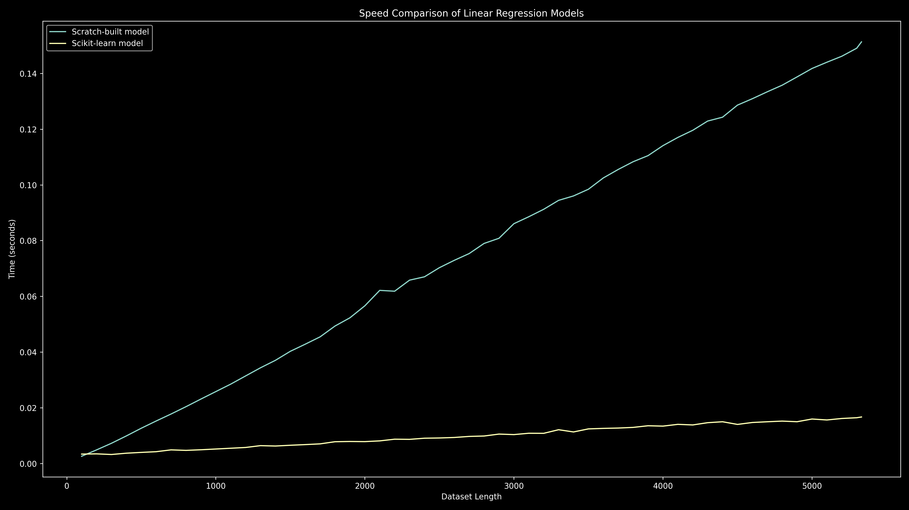

# Speed Test Against scikit-learn's Linear Regression

This comparison highlights the trade-off between control (scratch-built) and optimization (Scikit-learn), especially in compute-constrained environments.

## Summary

To further evaluate my scratch-built implementation of linear regression, I have created a speed test against scikit-learn's implementation. The results are quite interesting. I found that my implementation is faster than scikit-learn's for smaller datasets! Although the dataset contains just 5332 rows.

However, that’s just one side of the story. The scratch implementation is definitely faster, but only for smaller datasets. As the dataset size increases, the performance of the scratch implementation degrades significantly compared to scikit-learn's implementation!

### Key Takeaways

- **Scratch-built model** is faster on small datasets but does not scale well.
- **scikit-learn** is significantly faster and better optimized for larger datasets.
- **Even without optimization, the scratch-built model** processed 32,500 rows in under 1s!
- **Great for learning, benchmarking, and systems with no external library access.**

**_Note: All benchmarks were run on a Ryzen 5 5600G with 8 GB RAM and Python 3.12 on Fedora 42 Workstation. Performance may vary depending on system specifications._**

## Results With Smaller Datasets

First, I created a Python script to measure the speed of each implementation. I left the code as it is for preprocessing. The current version generates fewer elements in the feature vector for each location.

After running the speed test using the [script](#script-i-used) provided below, I got the following results:

### 1st Run

```plaintext
❯ python speed_test.py
Downloading: █████████████████████████ 100.00% (325679/325679 bytes)

File downloaded to: data/raw/formatted-csv-dhaka-rent-predictor.csv from url: https://gist.githubusercontent.com/RakibulHasanRatul/9101d6c95bbd3800e1c22b68e6462d76/raw/8d1b1cd8356e0a2ad2db205531421a48660eb6ba/formatted-csv-dhaka-rent-predictor.csv

Working on 125 locations.
Skipped 149 locations due to insufficient data.
Running scratch-built model...
Scratch-built model took 0.1368 seconds.
Running sklearn model...
Sklearn model took 0.2954 seconds.
```

### 2nd Run

```plaintext
❯ python speed_test.py
Downloading: █████████████████████████ 100.00% (325679/325679 bytes)

File downloaded to: data/raw/formatted-csv-dhaka-rent-predictor.csv from url: https://gist.githubusercontent.com/RakibulHasanRatul/9101d6c95bbd3800e1c22b68e6462d76/raw/8d1b1cd8356e0a2ad2db205531421a48660eb6ba/formatted-csv-dhaka-rent-predictor.csv

Working on 125 locations.
Skipped 149 locations due to insufficient data.
Running scratch-built model...
Scratch-built model took 0.1372 seconds.
Running sklearn model...
Sklearn model took 0.2826 seconds.
```

### 3rd Run

```plaintext
❯ python speed_test.py
Downloading: █████████████████████████ 100.00% (325679/325679 bytes)

File downloaded to: data/raw/formatted-csv-dhaka-rent-predictor.csv from url: https://gist.githubusercontent.com/RakibulHasanRatul/9101d6c95bbd3800e1c22b68e6462d76/raw/8d1b1cd8356e0a2ad2db205531421a48660eb6ba/formatted-csv-dhaka-rent-predictor.csv

Working on 125 locations.
Skipped 149 locations due to insufficient data.
Running scratch-built model...
Scratch-built model took 0.1379 seconds.
Running sklearn model...
Sklearn model took 0.2903 seconds.
```

### Summary of Results with Smaller Dataset

The speed test was conducted three times, and the results were consistent across runs. The scratch-built linear regression model consistently outperformed scikit-learn's implementation in terms of execution time.  
The average time taken by the scratch-built model was approximately 0.1373 seconds, while the average time for the scikit-learn model was around 0.2894 seconds.  
This indicates that the scratch implementation is approximately 1.9 times faster than scikit-learn's implementation for this specific dataset.

## Results With Larger Datasets

However, it's crucial to evaluate the performance of both models on larger datasets as well. Preliminary tests indicate that while the scratch-built model performs admirably on smaller datasets, its performance may degrade with larger datasets. In contrast, scikit-learn's implementation is optimized for scalability and may outperform the scratch model in such scenarios.

So, what I did here is to run the same [script](#script-i-used) but with a small tweak. I changed the `construct_location_from_area` function in the `app/handler/data/preprocess.py`. It ensures larger feature set is created for a specific location. The change I made is:

```python
def construct_location_from_area(addr: str) -> str:
    parts = [part.strip() for part in addr.split(",")]
    if len(parts) < 2:
        return addr.title()

    level2 = parts[-2]
    level1 = parts[-1]

    return f"{level2}, {level1}".title()
```

After changing the function, I ran the same script and got following results:

### 1st Run with Larger Datasets

```plaintext
❯ python speed_test.py
Downloading: █████████████████████████ 100.00% (325679/325679 bytes)

File downloaded to: data/raw/formatted-csv-dhaka-rent-predictor.csv from url: https://gist.githubusercontent.com/RakibulHasanRatul/9101d6c95bbd3800e1c22b68e6462d76/raw/8d1b1cd8356e0a2ad2db205531421a48660eb6ba/formatted-csv-dhaka-rent-predictor.csv

Working on 41 locations.
Skipped 19 locations due to insufficient data.
Running scratch-built model...
Scratch-built model took 0.1334 seconds.
Running sklearn model...
Sklearn model took 0.1058 seconds.
```

### 2nd Run with Larger Datasets

```plaintext
❯ python speed_test.py
Downloading: █████████████████████████ 100.00% (325679/325679 bytes)

File downloaded to: data/raw/formatted-csv-dhaka-rent-predictor.csv from url: https://gist.githubusercontent.com/RakibulHasanRatul/9101d6c95bbd3800e1c22b68e6462d76/raw/8d1b1cd8356e0a2ad2db205531421a48660eb6ba/formatted-csv-dhaka-rent-predictor.csv

Working on 41 locations.
Skipped 19 locations due to insufficient data.
Running scratch-built model...
Scratch-built model took 0.1327 seconds.
Running sklearn model...
Sklearn model took 0.1051 seconds
```

### 3rd Run with Larger Datasets

```plaintext
❯ python speed_test.py
Downloading: █████████████████████████ 100.00% (325679/325679 bytes)

File downloaded to: data/raw/formatted-csv-dhaka-rent-predictor.csv from url: https://gist.githubusercontent.com/RakibulHasanRatul/9101d6c95bbd3800e1c22b68e6462d76/raw/8d1b1cd8356e0a2ad2db205531421a48660eb6ba/formatted-csv-dhaka-rent-predictor.csv

Working on 41 locations.
Skipped 19 locations due to insufficient data.
Running scratch-built model...
Scratch-built model took 0.1325 seconds.
Running sklearn model...
Sklearn model took 0.1057 seconds.
```

As expected, the performance difference narrows. But the difference is not as significant. The average time taken by the scratch-built model was approximately 0.1329 seconds, while the average time for the scikit-learn model was around 0.1055 seconds. Although in this case, the scratch-built model is approximately 1.26 times slower than scikit-learn's implementation.

## Summary of Results with Both Datasets

In summary, the speed test results indicate that the scratch-built linear regression model is faster than scikit-learn's implementation for **smaller datasets only**. For larger datasets, **scikit-learn's implementation is more efficient and robust**, making it a better choice for production use cases.

## Further Stresses!

Although I have tested and drew a conclusion, I think a further stress test can be done to see how the scratch-built model performs with larger datasets! To do so, I will change the [script](#script-i-used) a bit. Just changing the `run_speedtest` function will be enough. I shall attach the [modified run_speedtest function](#modified-script-for-stress-test).

This will ensure that the scratch-built model is tested against the entire dataset at once, rather than per location. This will give a better understanding of how the scratch-built model performs with larger datasets.

### 1st Stress Run

```plaintext
❯ python speed_test.py
Downloading: █████████████████████████ 100.00% (325679/325679 bytes)

File downloaded to: data/raw/formatted-csv-dhaka-rent-predictor.csv from url: https://gist.githubusercontent.com/RakibulHasanRatul/9101d6c95bbd3800e1c22b68e6462d76/raw/8d1b1cd8356e0a2ad2db205531421a48660eb6ba/formatted-csv-dhaka-rent-predictor.csv

Working on 5332 dataset.
Running scratch-built model...
Scratch-built model took 0.1475 seconds.
Running sklearn model...
Sklearn model took 0.0174 seconds.
```

### 2nd Stress Run

```plaintext
❯ python speed_test.py
Downloading: █████████████████████████ 100.00% (325679/325679 bytes)

File downloaded to: data/raw/formatted-csv-dhaka-rent-predictor.csv from url: https://gist.githubusercontent.com/RakibulHasanRatul/9101d6c95bbd3800e1c22b68e6462d76/raw/8d1b1cd8356e0a2ad2db205531421a48660eb6ba/formatted-csv-dhaka-rent-predictor.csv

Working on 5332 dataset.
Running scratch-built model...
Scratch-built model took 0.1473 seconds.
Running sklearn model...
Sklearn model took 0.0180 seconds.
```

### 3rd Stress Run

```plaintext
❯ python speed_test.py
Downloading: █████████████████████████ 100.00% (325679/325679 bytes)

File downloaded to: data/raw/formatted-csv-dhaka-rent-predictor.csv from url: https://gist.githubusercontent.com/RakibulHasanRatul/9101d6c95bbd3800e1c22b68e6462d76/raw/8d1b1cd8356e0a2ad2db205531421a48660eb6ba/formatted-csv-dhaka-rent-predictor.csv

Working on 5332 dataset.
Running scratch-built model...
Scratch-built model took 0.1464 seconds.
Running sklearn model...
Sklearn model took 0.0183 seconds.
```

### Conclusion of Stress Test

Noticed a pattern? **The scratch-built model's performance is too consistent yet** It is still predicting within 0.2 seconds.

However, the scikit-learn's implementation is way faster than the scratch-built model. It is taking around 0.02 seconds to run through the entire dataset, **exactly 10 times better**! It is expected, as scikit-learn's implementation is optimized for performance and scalability.

It’s still surprising how a non-optimized model completes training under 0.2 seconds with 5332 datasets!

## Speed Plot!

After running 2 speed tests - one with smaller dataset and another with larger dataset - it will be interesting to loop through a range and slice the feature's list for generating different length of datasets and run the speed test for each dataset! I should be using `matplotlib` to plot the speed test results.

To do so, I changed the [`run_speedtest function`](#modified-script-for-speed-plot) once again and plotted the plot. Here's the resulting plot:

> Speed comparison between scratch-built vs scikit-learn Linear Regression across dataset sizes.
> 

### Conclusion of Speed Plot!

It's interesting to see, in this test, the **scikit-learn's implementation is much faster than my scratch-built model** (as expected!) even for smaller datasets! But I showed and claimed that my implementation is faster than scikit-learn's implementation for smaller datasets! What about that claim?

This effect is likely due to `NumPy`’s **JIT-related optimizations kicking in after the first few runs**.! And **considering the numpy warmup time, the scratch-built model is still faster** than scikit-learn's implementation for smaller datasets.

In conclusion, the scratch-built model is well-suited for small datasets and constrained environments where external dependencies or system resources are limited. And **without optimizations, it still can be trained through 32,500 datasets in under 1 second**.

That’s a huge win — and a solid demonstration of what even non-optimized models can achieve.

## Script I Used

The python script I used for the speed test is as follows:

```python
from sklearn.linear_model import LinearRegression
import timeit
from app.handler.data.download import download_csv_from_gist
from app.handler.data.load import load_csv_data
from app.handler.data.preprocess import preprocess_loaded_data
from app.model.linear_regression import get_weight_vector
from config import FORMATTED_CSV_GIST_URL


def r_squared(y_predicted: list[float], y_original: list[float]) -> float:
    if len(y_original) != len(y_predicted):
        raise ValueError("Length of predicted and original lists must be the same.")

    y_mean = sum(y_original) / len(y_original)

    ss_total = sum((y - y_mean) ** 2 for y in y_original)
    if ss_total == 0:
        # All y values are (almost) the same, R squared value is undefined
        # treating as 0 for safe reporting
        return 0.0

    ss_residual = sum(
        (y_o - float(y_p)) ** 2 for y_o, y_p in zip(y_original, y_predicted)
    )

    return 1 - (ss_residual / ss_total)


def mse(y_predicted: list[float], y_original: list[float]) -> float:
    return sum(
        (float(y) - float(y_hat)) ** 2 for y, y_hat in zip(y_original, y_predicted)
    ) / len(y_original)


def mae(y_predicted: list[float], y_original: list[float]) -> float:
    return sum(
        abs(float(y) - float(y_hat)) for y, y_hat in zip(y_original, y_predicted)
    ) / len(y_original)


def run_speedtest():
    preprocessed_data = preprocess_loaded_data(
        load_csv_data(download_csv_from_gist(FORMATTED_CSV_GIST_URL))
    )

    locations = list(preprocessed_data.keys())

    work_on_location = [
        location
        for location in locations
        if len(preprocessed_data[location].feature_vectors) >= 10
    ]

    print("Working on {} locations.".format(len(work_on_location)))
    print(
        "Skipped {} locations due to insufficient data.".format(
            len(locations) - len(work_on_location)
        )
    )

    def run_scratch_built_model():
        for location in work_on_location:
            data = preprocessed_data[location]

            x_total = data.feature_vectors
            y_total = data.labels
            total = len(x_total)

            k = 5
            fold_size = total // k

            for fold in range(k):
                start = fold * fold_size
                end = start + fold_size

                x_test = x_total[start:end]
                y_test = y_total[start:end]

                x_train = x_total[:start] + x_total[end:]
                y_train = y_total[:start] + y_total[end:]

                weights = get_weight_vector(x_train, y_train)

                y_pred: list[float] = []
                for x in x_test:
                    pred = sum(w[0] * xi for w, xi in zip(weights, x))
                    y_pred.append(pred)

                r_squared(y_pred, y_test)
                mse(y_pred, y_test)
                mae(y_pred, y_test)

    def run_sklearn_model():
        for location in work_on_location:
            data = preprocessed_data[location]

            x_total = data.feature_vectors
            y_total = data.labels
            total = len(x_total)

            k = 5
            fold_size = total // k

            for fold in range(k):
                start = fold * fold_size
                end = start + fold_size

                x_test = x_total[start:end]
                y_test = y_total[start:end]

                x_train = x_total[:start] + x_total[end:]
                y_train = y_total[:start] + y_total[end:]

                model = LinearRegression()
                model.fit(x_train, y_train)

                y_pred: list[float] = model.predict(x_test).tolist()

                r_squared(y_pred, y_test)
                mse(y_pred, y_test)
                mae(y_pred, y_test)

    print("Running scratch-built model...")
    scratch_time = timeit.timeit(run_scratch_built_model, number=1)
    print(f"Scratch-built model took {scratch_time:.4f} seconds.")
    print("Running sklearn model...")
    sklearn_time = timeit.timeit(run_sklearn_model, number=1)
    print(f"Sklearn model took {sklearn_time:.4f} seconds.")


if __name__ == "__main__":
    run_speedtest()
```

## Modified Script for Stress Test

```python
def run_speedtest():
    preprocessed_data = preprocess_loaded_data(
        load_csv_data(download_csv_from_gist(FORMATTED_CSV_GIST_URL))
    )

    work_on_location = list(preprocessed_data.keys())

    x_total: list[list[float]] = []
    y_total: list[float] = []
    for location in work_on_location:
        x_total = x_total + preprocessed_data[location].feature_vectors
        y_total = y_total + preprocessed_data[location].labels

    dataset_len = len(x_total)

    print("Working on {} dataset.".format(dataset_len))

    def run_scratch_built_model():
        k = 5
        fold_size = dataset_len // k

        for fold in range(k):
            start = fold * fold_size
            end = start + fold_size

            x_test = x_total[start:end]
            y_test = y_total[start:end]

            x_train = x_total[:start] + x_total[end:]
            y_train = y_total[:start] + y_total[end:]

            weights = get_weight_vector(x_train, y_train)

            y_pred: list[float] = []
            for x in x_test:
                pred = sum(w[0] * xi for w, xi in zip(weights, x))
                y_pred.append(pred)

            r_squared(y_pred, y_test)
            mse(y_pred, y_test)
            mae(y_pred, y_test)

    def run_sklearn_model():
        k = 5
        fold_size = dataset_len // k

        for fold in range(k):
            start = fold * fold_size
            end = start + fold_size

            x_test = x_total[start:end]
            y_test = y_total[start:end]

            x_train = x_total[:start] + x_total[end:]
            y_train = y_total[:start] + y_total[end:]

            model = LinearRegression()
            model.fit(x_train, y_train)

            y_pred: list[float] = model.predict(x_test).tolist()

            r_squared(y_pred, y_test)
            mse(y_pred, y_test)
            mae(y_pred, y_test)

    print("Running scratch-built model...")
    scratch_time = timeit.timeit(run_scratch_built_model, number=1)
    print(f"Scratch-built model took {scratch_time:.4f} seconds.")
    print("Running sklearn model...")
    sklearn_time = timeit.timeit(run_sklearn_model, number=1)
    print(f"Sklearn model took {sklearn_time:.4f} seconds.")

```

## Modified Script for Speed Plot

```python
def run_speedtest():
    preprocessed_data = preprocess_loaded_data(
        load_csv_data(download_csv_from_gist(FORMATTED_CSV_GIST_URL))
    )

    locations = list(preprocessed_data.keys())

    x_total: list[list[float]] = []
    y_total: list[float] = []

    for location in locations:
        x_total = x_total + preprocessed_data[location].feature_vectors
        y_total = y_total + preprocessed_data[location].labels

    dataset_len_total = len(x_total)

    used_dataset_lengths: list[int] = []
    scratch_built_times: list[float] = []
    sklearn_times: list[float] = []

    def run_scratch_built_model(
        dataset_len: int, feature_vector: list[list[float]], label_vector: list[float]
    ):
        number_of_folds = 5
        fold_size = dataset_len // number_of_folds

        for fold in range(number_of_folds):
            start = fold * fold_size
            end = start + fold_size

            x_test = feature_vector[start:end]
            y_test = label_vector[start:end]

            x_train = feature_vector[:start] + feature_vector[end:]
            y_train = label_vector[:start] + label_vector[end:]

            weights = get_weight_vector(x_train, y_train)

            y_pred: list[float] = []
            for x in x_test:
                pred = sum(w[0] * xi for w, xi in zip(weights, x))
                y_pred.append(pred)

            r_squared(y_pred, y_test)
            mse(y_pred, y_test)
            mae(y_pred, y_test)

    def run_sklearn_model(
        dataset_len: int, feature_vector: list[list[float]], label_vector: list[float]
    ):
        number_of_folds = 5
        fold_size = dataset_len // number_of_folds

        for fold in range(number_of_folds):
            start = fold * fold_size
            end = start + fold_size

            x_test = feature_vector[start:end]
            y_test = label_vector[start:end]

            x_train = feature_vector[:start] + feature_vector[end:]
            y_train = label_vector[:start] + label_vector[end:]

            model = LinearRegression()
            model.fit(x_train, y_train)

            y_pred: list[float] = model.predict(x_test).tolist()

            r_squared(y_pred, y_test)
            mse(y_pred, y_test)
            mae(y_pred, y_test)

    dataset_len = 100
    while True:
        # yea, I could use conditions like dataset_len <= dataset_len_total,
        # but I want to use the full datasets
        print("Working on {} dataset.".format(dataset_len))
        print("Running scratch-built model with {} dataset...".format(dataset_len))
        scratch_time = timeit.timeit(
            lambda: run_scratch_built_model(
                dataset_len, x_total[:dataset_len], y_total[:dataset_len]
            ),
            number=1,
        )
        print(f"Scratch-built model took {scratch_time:.4f} seconds.")
        print("Running sklearn model with {} dataset...".format(dataset_len))
        sklearn_time = timeit.timeit(
            lambda: run_sklearn_model(
                dataset_len, x_total[:dataset_len], y_total[:dataset_len]
            ),
            number=1,
        )
        print(f"Sklearn model took {sklearn_time:.4f} seconds.")

        used_dataset_lengths.append(dataset_len)
        scratch_built_times.append(scratch_time)
        sklearn_times.append(sklearn_time)

        if dataset_len == dataset_len_total:
            break

        dataset_len += 100

        if dataset_len > dataset_len_total:
            dataset_len = dataset_len_total

    plt.style.use("dark_background")  # jsut because I like dark themes a lot!
    plt.figure(figsize=(16, 9))
    plt.plot(
        used_dataset_lengths,
        scratch_built_times,
        label="Scratch-built model",
    )
    plt.plot(
        used_dataset_lengths,
        sklearn_times,
        label="scikit-learn model",
    )
    plt.xlabel("Dataset Length")
    plt.ylabel("Time (seconds)")
    plt.title("Speed Comparison of Linear Regression Models")
    plt.legend()
    plt.tight_layout()
    plt.savefig("images/speed_comparison.png", dpi=250)
```
